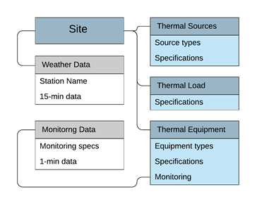
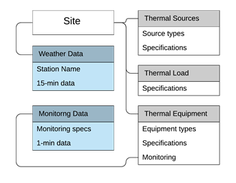

## oTherm Data Specification for GSHP Systems

The oTherm framework consists of a backend web application written in Python (Django platform) with two databases 
(SQL and Time Series) that is ‘containerized’ using Docker for efficient deployment.   The front end and APIs supports 
efficient data entry and retrieval. 

The oTherm data models are generally divided into the Device-Level Data Model and the Facility-Level Data Model. 
The rationale for the tables and relationship are covered in some detail in other project documents.   Generally, 
the Device-Level Data Model focuses on monitoring systems and monitoring data while the Facility-Level Data Model 
focuses on information about the site, the thermal sources, and the thermal load.   This Data Specification provides 
a comprehensive description of each of the tables and their relationships.  

### Facility Level Data (SQL)
The static data is stored in a PostgreSQL database and the tables can be split into two general groups.  The first 
group of tables are those that likely contain new and site-specific information.  The second group of 
tables contain information that can likely be utilized by multiple sites.  For example, a monitoring system 
may be defined once and then an instance of that monitoring system may be deployed at multiple sites.   Tables 
with site data can be configured to be accessible to oTherm users while tables that can be used between sites can 
be restricted to those with administrative privileges.   The [SQL data model specification](./django-data-model-specs.pdf) 
provides a detailed description of the SQL tables and fields.

The relationships between the tables is summarized in SchemaSpy images in both [compact](./relationships.real.compact.png) 
and the [large](./relationships.real.large.png) formats.

### Time Series Data (no-SQL)
While we often associate the term ‘measurement’ with a single instance. In the context of time series data, a 
measurement is a collection of tags, fields, and timestamps.  

In oTherm, the heat pump operating data for all heat pumps and all times is considered a measurement ‘monitoring-data’ 
and the weather data is considered a separate measurement (‘weather-data’). The elements for each of these measurements 
are described in the [Time-seried data model specification](./influx-data-model-specs.pdf).

#### Line Protocol Input
In some cases, it may be necessary to upload time series data into the database.  This can be done using text files 
with data in a ‘line protocol’ format.  Each line represents a collection of (1) measurement name, (2) tag key:value pair, 
(3) a set of field key:value pairs, and (4) a time stamp in epoch time   Single spaces delimit each of these elements.  
Key value pairs in a field set are delimited by commas.   It is important that spaces are not included after commas. A 
sample Python Script for creating line-protocol files is provided in the [oTherm GSHP analytics repository](https://github.com/otherm/gshp-analysis) 

## Mapping to related DOE Data Specifications
oTherm looks to build upon ongoing efforts to develop data standards and data repositories related to building energy 
usage with renewable thermal systems installed in buildings.  There are two Department of Energy supported data 
standards that are particularly relevant to oTherm.  
  
### Mapping to BEDES
The data elements of the facility level data model are mapped onto the Building Energy Data Exchange Specification (BEDES) 
to facilitate the integration of oTherm with other building energy applications.   The BEDES dictionary is organized 
into data terms that each have a data types that include Decimal, Integer, String, TimeStamp, and Constrained Lists.  
These individual (atomic) terms can also be combined into Composite Terms to provide additional context.   For example, 
the term to describe the area of a building that receives space conditioning (conditioned_area) can be defined by 
combining two atomic BEDES  terms (Conditioned Status = “Conditioned” and Area = [value]) with units of square feet.  
The creation of composite terms can be subjective and for some terms that were not originally envisioned in BEDES, 
the mapping can become cumbersome and the benefit of mapping becomes questionable.   This is true for many of the 
oTherm terms that describe specific characteristics of a ground loop heat exchanger. 
[oTherm mapping to BEDES](./oTherm_BEDES_mapping.pdf)

### Mapping to NGDS 
The National Geotherm Data System enables compilation of a diverse set of data products over a wide 
range of geothermal applications.  Here, the oTherm data model fields have been mapped on the 
[NGDS Heat Pump Facility](https://geothermaldata.org/content-model/heat-pump-facility) model. In general, the 
NGDS Heat Pump Facility model places more emphasis on the characteristics of the subsurface and the ground heat 
exchanger.   
[oTherm mapping to NGDS](./oTherm_NGDS-HeatPumpFacility_mapping.pdf)
  
